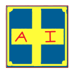

 

<h1>正德人工智障</h1>

這只是個垃圾項目,非真正要用AI的在下載

## 跳轉

- [特色功能](#特色功能)
- [關於模型](#關於模型)
- [可回應句子](#可回應句子)
- [編譯所需環境](#編譯所需環境)
- [Makefile](#makefile-僅限linux)

## ***V0.4-alpha.1*更新日誌**

- 新增PRO版模型 *(free)*
- 重寫boom底層
- 幹掉了音檔

## **特色功能**

- 有用的加載
- 沒什麼用的安靜模式
- 採用先進if else架構
- 純手工句子千篇一律
- CLI介面

## **關於模型**

- 參數量: **0B**
- 目前可回應句子: **13句**
- 回應語言: **繁體中文 + 英文**

## **可回應句子**

- 關於校長的頭
- 關於校長
- 中原在哪
- 關於你
- 生態池裡最多的是什麼
- 今年是西元幾年
- who are you
- 什麼是家政課
- boom *(謹慎使用)*
- 向陽廣場附近的聲音是什麼生物的 *(PRO)*
- 吃飯時適合配什麼
- 退出
- quit

## **編譯所需環境**

- Linux版編譯器:**`gcc`** / **`clang`** *(默認`gcc`)*
- windows版編譯器:**`mingw32-gcc`** *(默認`mingw32-gcc`)*
- 所需庫: **`stdio`**/**`stdlib`**/**`string`**/**`unistd`**/**`time`**
- 但我已經打包好發行版了! *(僅windows X86-64和Linux X86-64)*

## **Makefile** *(僅限Linux)*

- **`make` / `make Linux`**: 編譯Linux版本
- **`make win`**: 編譯Windows版本
- **`make linux/win DEBUG=1`**: 控制除錯 *(默認為0,不除錯)*
- **`make cleanlinux`**: 清理Linux版編譯後產物
- **`make cleanwin`**: 清理windows版編譯後產物
- **`make clean`**: 清理所有編譯後產物

---

就這樣,真的只是個拿來玩玩的垃圾
